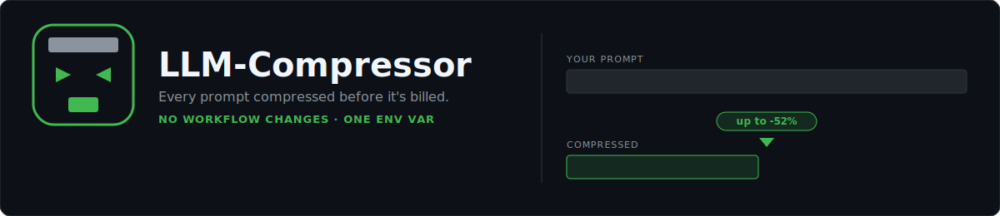
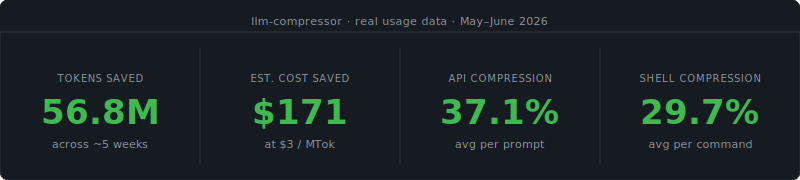
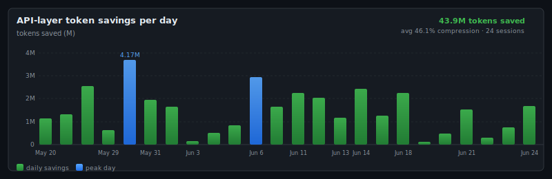
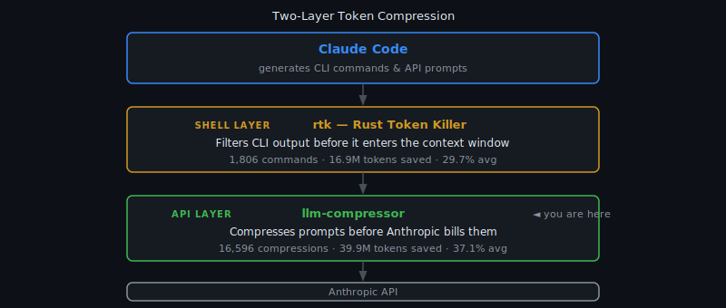

# LLM-Compressor



- **Transparent proxy** — one env var, no workflow changes; Claude never notices.
- **~47–52% token savings** — compresses the `system` field and `user` messages before every API call.
- **Live dashboard** — per-session compression ratios, sparklines, cache hit rate.
- **4 compression models** — pick a tradeoff from fast/light to aggressive/precise.
- **Stacks with [rtk](https://github.com/rtk-ai/rtk)** — two independent savings layers: shell output + API payload.
- **Optional Langfuse tracing** — full observability into every compressed request.

If you use Claude Code daily, every request resends the full conversation history plus your entire `CLAUDE.md`. Those tokens add up fast. LLM-Compressor sits transparently between Claude Code and the Anthropic API and shrinks each payload with a local compression model before forwarding it. Claude never notices. Your invoice does.

---

If this saves you tokens, ⭐ star the repo — it helps others find it.

**[Install in 3 steps ↓](#install)** &nbsp;·&nbsp; [](https://buymeacoffee.com/jeancsil)

```
make install     install dependencies
make start       start proxy
make stop        stop proxy
make restart     stop then start fresh
make check       verify proxy is up
make dashboard   open live dashboard
make stats       print compression stats (JSON)
make rtk-stats   print rtk shell-layer savings
```

---

## By the numbers

The stats and chart below are generated from real usage data — `metrics.db` logged by this proxy across ~5 weeks of daily Claude Code sessions.





**For API key users** this is direct invoice reduction at Sonnet 4.6 input rates ($3/MTok). **For Pro subscribers** (flat €18–$20/month) it translates to roughly 35% more Claude Code turns per 5-hour usage window before hitting limits — and directly reduces cost if you buy extra usage credits.

> Token counts use the compression model's tokenizer, not Claude's billing tokenizer — a good proxy for relative savings, not a 1:1 invoice mapping. System-field tokens (CLAUDE.md etc.) are prompt-cached by Anthropic after turn 1 and billed at $0.30/MTok, not $3.00/MTok — so their monetary value is lower than raw token counts suggest. User-message tokens dominate (97% of savings) and are not cached.

---

## How it works

LLM-Compressor stacks with [rtk](https://github.com/rtk-ai/rtk) to save tokens at two independent layers:



**Does not conflict with rtk.** The two tools operate at different layers:

| Tool | Layer | What it compresses |
|---|---|---|
| **rtk** | Shell | CLI command output before it enters the context window |
| **LLM-Compressor** (this) | API | Conversation messages before they're billed |

Running both compounds the savings. The dashboard automatically detects rtk and switches to a two-layer view when it is present.

---

## Install

**Requirements:** Python 3.12 · [uv](https://github.com/astral-sh/uv) (`brew install uv`) · Anthropic API key

```bash
git clone https://github.com/jeancsil/llm-compressor
cd llm-compressor
make install
```

## Start the proxy

```bash
export ANTHROPIC_API_KEY=sk-ant-...
make start
```

The first run downloads the compression model and loads it. Cold start is 20–90 seconds depending on the model. Once you see:

```
Model ready.
INFO:     Uvicorn running on http://127.0.0.1:9099
```

the proxy is ready. Verify with:

```bash
make check
```

## Configure Claude Code

In your Claude Code terminal (or add to `~/.zshrc`):

```bash
export ANTHROPIC_BASE_URL=http://127.0.0.1:9099
claude
```

That's all. Claude Code now routes through the proxy transparently.

To stop the proxy:

```bash
make stop
```

To stop compressing without stopping the proxy:

```bash
unset ANTHROPIC_BASE_URL
```

### Alternative: `wrap` — ephemeral daemon (no manual start/stop)

Instead of running the proxy as a persistent daemon, you can let the CLI manage it automatically:

```bash
uv run llm-compressor wrap claude
```

This single command:
1. Spawns the proxy in the background
2. Waits until it's healthy (up to 30 s)
3. Injects `ANTHROPIC_BASE_URL` for the child process only
4. Runs your agent command with full TTY
5. Kills the proxy when the agent exits

Works with any agent: `claude`, `aider`, `cursor`, etc. The proxy is completely invisible — you never touch `make start` or `make stop`.

---

## Dashboard

While the proxy is running:

```bash
make dashboard   # opens http://127.0.0.1:9099/dashboard in your browser
```

The dashboard auto-refreshes every 2 seconds and shows:

- Overall compression ratio
- Per-session efficiency bars and ratio badges
- Sparkline of recent requests colored by savings percentage
- Full session table with request counts and last-seen times

### rtk integration

If [rtk](https://github.com/rtk-ai/rtk) is installed, the dashboard automatically reads its tracking database and switches to a two-layer view:

- **Shell layer** — rtk's total commands, tokens saved, and a top-commands breakdown
- **API layer** — per-session compression stats (existing view)

No configuration required. The proxy reads rtk's SQLite database at the standard platform path in read-only mode:

| OS | Path |
|---|---|
| macOS | `~/Library/Application Support/rtk/history.db` |
| Linux | `~/.local/share/rtk/history.db` |
| Windows | `%APPDATA%\rtk\history.db` |

Install rtk:

```bash
brew install rtk   # macOS
```

---

## Compression models

| Model ID | Underlying model | Download | Notes |
|---|---|---|---|
| `llmlingua2` | [microsoft/llmlingua-2-bert-base-multilingual-cased-meetingbank](https://huggingface.co/microsoft/llmlingua-2-bert-base-multilingual-cased-meetingbank) | **677 MB** | Default; ~47% savings |
| `llmlingua2-large` | [microsoft/llmlingua-2-xlm-roberta-large-meetingbank](https://huggingface.co/microsoft/llmlingua-2-xlm-roberta-large-meetingbank) | **2.1 GB** | More aggressive; ~52% savings; 3× slower |
| `kompress` | [chopratejas/kompress-v2-base](https://huggingface.co/chopratejas/kompress-v2-base) | **301 MB** | Precision-oriented; ~27% savings; lower distortion |
| `dual` | llmlingua2-large + kompress (both loaded) | **~2.4 GB** | Routes system→llmlingua2-large, user→kompress |

Models are downloaded from HuggingFace on first use and cached in `~/.cache/huggingface/hub`.

Switch via the dashboard dropdown (`make dashboard`) or directly:

```bash
curl -s -X POST http://127.0.0.1:9099/admin/set-model \
  -H 'Content-Type: application/json' -d '{"model": "kompress"}'
```

---

## Compression modes

Every Anthropic API call is **stateless**: the client resends the full conversation on each request. The `system` field (CLAUDE.md, RTK.md, injected context) and all previous `user` turns are retransmitted every time — compressing saves tokens on every call, not just the first.

### What gets compressed

| Part | Compressed? | Reason |
|---|---|---|
| `system` field | **Yes** | Heaviest payload; pure boilerplate sent on every call |
| `user` messages | **Yes** | User intent; compression applied with care |
| `assistant` messages | **No** | Model reads its own prior reasoning; compressing them causes self-confusion |

### Single-model mode (default)

One compression model handles everything. Select from `make dashboard` (dropdown) or directly:

```bash
curl -s -X POST http://127.0.0.1:9099/admin/set-model \
  -H 'Content-Type: application/json' \
  -d '{"model": "llmlingua2-large"}'
```

Available models: `llmlingua2`, `llmlingua2-large`, `kompress`, `dual`

### Dual mode

Select **"dual (system→large · user→kompress)"** from `make dashboard` or directly:

```bash
curl -s -X POST http://127.0.0.1:9099/admin/set-model \
  -H 'Content-Type: application/json' \
  -d '{"model": "dual"}'
```

Dual mode loads both models simultaneously (~2.4 GB RAM). Cold start takes 60–90 seconds.

### Auditing compressions

Compression is logged to `metrics.db` with the `role` column (`system` or `user`). Query directly:

```bash
sqlite3 metrics.db \
  "SELECT role, model, COUNT(*), ROUND(AVG((1.0 - compressed_tokens*1.0/original_tokens)*100),1) AS avg_savings_pct FROM compressions GROUP BY role, model"
```

The dashboard recent-activity table shows each row's role with a color-coded badge (blue = system, green = user).

### Compression cache

The proxy maintains an **exact-match cache** keyed on `sha256(text) | model | rate`. The unit of caching is one message block — a single `system` field value or a single `user` content block — not the full conversation payload.

This granularity is deliberate. The Anthropic API is stateless: every request resends the full conversation history. That means:

- The `system` field (your `CLAUDE.md`, injected context, etc.) is identical across every turn in a session → **compressed once, served from cache for every subsequent turn (~95% hit rate in practice).**
- Older `user` messages in the history are retransmitted unchanged → **cache hits on all prior turns, miss only on the newest one.**

Chunk-splitting (breaking a block into smaller pieces) would add complexity without meaningfully improving the hit rate, because the natural repetition unit is already the message block. A block either repeats exactly (hit) or it doesn't (miss); partial-overlap cases are rare in practice.

The cache is a bounded in-memory LRU backed by a SQLite `compression_cache` table. Env vars to tune it:

| Variable | Default | Effect |
|---|---|---|
| `LLM_COMPRESSOR_CACHE_SIZE` | `2000` | Max entries in the in-memory LRU |
| `LLM_COMPRESSOR_CACHE_MAX_ROWS` | `50000` | Max rows on disk (`0` disables disk cache) |

Hit ratio is reported by `/stats` as `cache.since_deploy` and `cache.last_24h`, and displayed on the dashboard's **Cache Hit Rate** card.

---

## Endpoints

| Method | Path | Description |
|---|---|---|
| `POST` | `/v1/messages` | Main proxy target; compresses then forwards |
| `GET` | `/v1/models` | Passthrough to Anthropic |
| `GET` | `/stats` | JSON compression statistics |
| `GET` | `/dashboard` | Live HTML dashboard |
| `GET` | `/` | Health check |

## Configuration

All configuration is via environment variables:

| Variable | Default | Description |
|---|---|---|
| `ANTHROPIC_API_KEY` | — | **Required.** Your Anthropic API key |
| `ANTHROPIC_BASE_URL` | — | Set to `http://127.0.0.1:9099` in the Claude Code terminal |
| `LANGFUSE_PUBLIC_KEY` | — | Optional. Enables Langfuse tracing when set with secret key |
| `LANGFUSE_SECRET_KEY` | — | Optional. See above |
| `LANGFUSE_HOST` | `https://cloud.langfuse.com` | Optional. Override for self-hosted Langfuse |

The compression rate (default `0.5`) and minimum text length (default `200` chars) are constants in `proxy.py` at the top of `compress_text()`.

---

## Observability (optional)

LLM-Compressor can send a trace to [Langfuse](https://langfuse.com) for every proxied request — model used, compressed input, output, token counts, and compression metadata.

**Setup:**

```bash
make install-langfuse
```

Export your keys before starting the proxy:

```bash
export LANGFUSE_PUBLIC_KEY=pk-lf-...
export LANGFUSE_SECRET_KEY=sk-lf-...
make restart
```

**Verify:**

```bash
make langfuse-status   # → {"enabled": true, ...}
make langfuse-test     # sends a real request; check cloud.langfuse.com/traces
```

Tracing is fire-and-forget — errors are logged to `proxy.log` but never affect the proxy or your Claude Code session. The proxy starts without tracing if the keys are absent.
