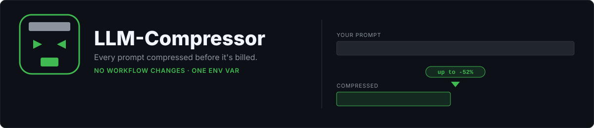
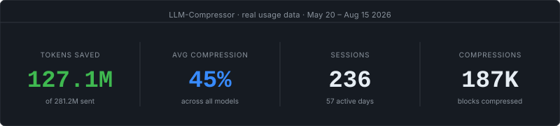
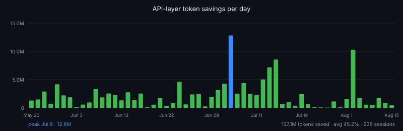
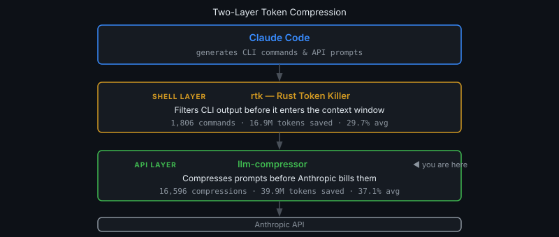

# LLM-Compressor



- **Transparent proxy** — one env var, no workflow changes; Claude never notices.
- **~45% token savings in practice** — compresses the `system` field and `user` messages before every API call.
- **Live dashboard** — overview, per-session drilldown, playground, and settings, in light or dark.
- **4 compression models** — pick a tradeoff from fast/light to aggressive/precise.
- **~96% cache hit rate** — repeated system prompts and prior turns are compressed once, then served from cache.
- **Stacks with [rtk](https://github.com/rtk-ai/rtk)** — two independent savings layers: shell output + API payload.
- **Optional Langfuse tracing** — full observability into every compressed request.

If you use Claude Code daily, every request resends the full conversation history plus your entire `CLAUDE.md`. Those tokens add up fast. LLM-Compressor sits transparently between Claude Code and the Anthropic API and shrinks each payload with a local compression model before forwarding it. Claude never notices. Your invoice does.

---

If this saves you tokens, ⭐ star the repo — it helps others find it.

**[Install in 3 steps ↓](#install)** &nbsp;·&nbsp; [](https://buymeacoffee.com/jeancsil)

```
make install                       install dependencies
uv run llm-compressor wrap claude  run Claude Code through the proxy
make dashboard                     open live dashboard
make stats                         print compression stats (JSON)
make rtk-stats                     print rtk shell-layer savings
```

---

## By the numbers

Generated from real usage — the `metrics.db` this proxy has been logging across daily Claude Code sessions since May 2026. Regenerate them yourself at any time with `make assets`.





**For API key users** this is direct invoice reduction at Sonnet 4.6 input rates ($3/MTok). **For Pro subscribers** (flat €18–$20/month) it means meaningfully more Claude Code turns per 5-hour usage window before hitting limits — and directly reduces cost if you buy extra usage credits.

> **How to read these numbers.** Token counts use the compression model's tokenizer, not Claude's billing tokenizer — a good proxy for relative savings, not a 1:1 invoice mapping. Savings split roughly evenly between the two roles (≈51% system, ≈49% user). System-field tokens are prompt-cached by Anthropic after turn 1 and billed at $0.30/MTok rather than $3.00/MTok, so that half is worth less per token than the raw count suggests; the user-message half is not cached and bills at full rate.

---

## How it works

LLM-Compressor stacks with [rtk](https://github.com/rtk-ai/rtk) to save tokens at two independent layers:



**Does not conflict with rtk.** The two tools operate at different layers:

| Tool | Layer | What it compresses |
|---|---|---|
| **rtk** | Shell | CLI command output before it enters the context window |
| **LLM-Compressor** (this) | API | Conversation messages before they're billed |

Running both compounds the savings. The dashboard automatically detects rtk and surfaces its shell-layer numbers alongside the API-layer ones.

---

## Install

**Requirements:** Python 3.12 · [uv](https://github.com/astral-sh/uv) (`brew install uv`) · Anthropic API key

```bash
git clone https://github.com/jeancsil/llm-compressor
cd llm-compressor
make install
```

## Run Claude Code through the proxy

```bash
export ANTHROPIC_API_KEY=sk-ant-...
uv run llm-compressor wrap claude
```

This single command:
1. Spawns the proxy in the background
2. Waits until it's healthy (up to 30 s)
3. Injects `ANTHROPIC_BASE_URL` for the child process only
4. Runs `claude` with full TTY
5. Kills the proxy when `claude` exits

The first run downloads the compression model and loads it, so the first `wrap` invocation takes 20–90 seconds depending on the model. Works with any agent: `wrap claude`, `wrap aider`, `wrap cursor`, etc. There's no proxy to manually start, stop, or point `ANTHROPIC_BASE_URL` at — it's invisible.

### Alternative: persistent daemon

If you'd rather run the proxy continuously across multiple terminals/agents instead of spawning it per-command:

```bash
export ANTHROPIC_API_KEY=sk-ant-...
make start    # starts in foreground; Ctrl-C to stop, or `make stop` from another shell
```

Then point any client at it manually:

```bash
export ANTHROPIC_BASE_URL=http://127.0.0.1:9099
claude
```

Verify it's up with `make check`. Unset `ANTHROPIC_BASE_URL` to stop compressing without killing the proxy.

---

## Dashboard

While the proxy is running:

```bash
make dashboard   # opens http://127.0.0.1:9099/overview
```

The dashboard is a four-page app sharing one nav bar, with a light/dark/system theme toggle. It auto-refreshes as new requests arrive.

| Page | Path | What's on it |
|---|---|---|
| **Overview** | `/overview` | Stat tiles (tokens saved, cost saved, avg savings %, requests, P95 latency), a stacked *token flow* chart of compressed-vs-saved per bucket, a per-model breakdown, cache hit ratios by role, and a recent-activity table |
| **Sessions** | `/sessions` | Every session with its name, request count, savings, and last-seen time |
| **Session detail** | `/sessions/{id}` | That session's compression history — original vs compressed text side by side — plus its rtk shell commands when rtk is installed |
| **Playground** | `/playground` | Paste any prompt and compress it with a chosen model, outside the proxy flow, to see exactly what compression does to your text |
| **Settings** | `/settings` | Pick the active model, configure dual-mode routing, check Langfuse status, delete stored prompt text, set the theme |

Overview's time-range selector (24h / 48h / 7d / 30d) scopes the tiles and charts.

The older `/dashboard`, `/dashboard/{id}`, `/play`, and `/play/list` URLs still work and redirect to their replacements above.

### Session names

Sessions are labeled automatically from their first few user turns, so the session list reads as a list of tasks rather than UUIDs. By default the label comes from a local deterministic heuristic — no extra API calls. Set `LLM_COMPRESSOR_LLM_NAMING=1` to have Claude Haiku write the label instead; it reuses the caller's own credentials, so no separate key is needed. You can always rename a session by hand from the session page.

### rtk integration

If [rtk](https://github.com/rtk-ai/rtk) is installed, the dashboard automatically reads its tracking database and adds the shell layer:

- **Shell layer** — rtk's total commands, tokens saved, and per-session command history
- **API layer** — the compression stats above

No configuration required. The proxy reads rtk's SQLite database at the standard platform path in read-only mode:

| OS | Path |
|---|---|
| macOS | `~/Library/Application Support/rtk/history.db` |
| Linux | `~/.local/share/rtk/history.db` |
| Windows | `%APPDATA%\rtk\history.db` |

Install rtk:

```bash
brew install rtk   # macOS
```

---

## Compression models

| Model ID | Underlying model | Download | Notes |
|---|---|---|---|
| `llmlingua2` | [microsoft/llmlingua-2-bert-base-multilingual-cased-meetingbank](https://huggingface.co/microsoft/llmlingua-2-bert-base-multilingual-cased-meetingbank) | **677 MB** | Default; ~47% savings; fastest |
| `llmlingua2-large` | [microsoft/llmlingua-2-xlm-roberta-large-meetingbank](https://huggingface.co/microsoft/llmlingua-2-xlm-roberta-large-meetingbank) | **2.1 GB** | Most aggressive; ~52% savings; roughly 3× slower |
| `kompress` | [chopratejas/kompress-v2-base](https://huggingface.co/chopratejas/kompress-v2-base) | **301 MB** | Precision-oriented; ~27% savings; lower distortion |
| `dual` | two of the above, both loaded | **~1.5 GB RAM** | Routes `system` and `user` to different models |

Models are downloaded from HuggingFace on first use and cached in `~/.cache/huggingface/hub`.

Switch from **Settings** in the dashboard, or directly:

```bash
curl -s -X POST http://127.0.0.1:9099/admin/set-model \
  -H 'Content-Type: application/json' -d '{"model": "kompress"}'
```

The choice is persisted in the database and restored on the next start. Switching loads the new backend in the background; the proxy keeps serving with the old one until it's ready.

---

## Compression modes

Every Anthropic API call is **stateless**: the client resends the full conversation on each request. The `system` field (CLAUDE.md, RTK.md, injected context) and all previous `user` turns are retransmitted every time — compressing saves tokens on every call, not just the first.

### What gets compressed

| Part | Compressed? | Reason |
|---|---|---|
| `system` field | **Yes** | Heaviest payload; pure boilerplate sent on every call |
| `user` messages | **Yes** | User intent; compression applied with care |
| `assistant` messages | **No** | Model reads its own prior reasoning; compressing them causes self-confusion |

Text shorter than 200 characters is passed through untouched — compressing it costs more latency than it saves.

### Single-model mode (default)

One compression model handles both roles. Pick it from **Settings**, or:

```bash
curl -s -X POST http://127.0.0.1:9099/admin/set-model \
  -H 'Content-Type: application/json' \
  -d '{"model": "llmlingua2-large"}'
```

### Dual mode

Dual mode runs a different model per role — the intuition being that a system prompt tolerates aggressive compression better than a user's actual question does. Defaults are `llmlingua2-large` for `system` and `kompress` for `user`, and both are configurable:

```bash
curl -s -X POST http://127.0.0.1:9099/admin/set-model \
  -H 'Content-Type: application/json' -d '{"model": "dual"}'

curl -s -X POST http://127.0.0.1:9099/admin/set-dual-models \
  -H 'Content-Type: application/json' \
  -d '{"system": "llmlingua2-large", "user": "kompress"}'
```

Valid values for each role: `llmlingua2`, `llmlingua2-large`, `kompress`. Omit a key to leave it unchanged. Dual mode holds both models in memory (~1.5 GB RAM) and takes 60–90 seconds to cold start.

### Auditing compressions

Every compression is logged with its `role` (`system` or `user`). The recent-activity table on Overview shows each row's role with a color-coded badge, and each session page shows the original and compressed text side by side.

To query the database directly:

```bash
sqlite3 "$(python3 -c 'import db; print(db.DB_PATH)')" \
  "SELECT role, model, COUNT(*), ROUND(AVG((1.0 - compressed_tokens*1.0/original_tokens)*100),1) AS avg_savings_pct
   FROM compressions GROUP BY role, model"
```

If you'd rather not retain prompt text at all, **Settings → Delete stored prompt text** wipes it while keeping all statistics intact.

### Compression cache

The proxy maintains an **exact-match cache** keyed on `sha256(text) | model | rate`. The unit of caching is one message block — a single `system` field value or a single `user` content block — not the full conversation payload.

This granularity is deliberate. The Anthropic API is stateless: every request resends the full conversation history. That means:

- The `system` field (your `CLAUDE.md`, injected context, etc.) is identical across every turn in a session → **compressed once, served from cache for every subsequent turn (~99% hit rate in practice).**
- Older `user` messages in the history are retransmitted unchanged → **cache hits on all prior turns, miss only on the newest one (~96%).**

This matters more than it sounds: a `system`-field miss costs seconds of model time, so the cache is what keeps the proxy's overhead invisible during a session.

Chunk-splitting (breaking a block into smaller pieces) would add complexity without meaningfully improving the hit rate, because the natural repetition unit is already the message block. A block either repeats exactly (hit) or it doesn't (miss); partial-overlap cases are rare in practice.

The cache is a bounded in-memory LRU backed by a SQLite `compression_cache` table. Env vars to tune it:

| Variable | Default | Effect |
|---|---|---|
| `LLM_COMPRESSOR_CACHE_SIZE` | `2000` | Max entries in the in-memory LRU |
| `LLM_COMPRESSOR_CACHE_MAX_ROWS` | `50000` | Max rows on disk (`0` disables disk cache) |

Hit ratios are reported by `/stats` as `cache.since_deploy` and `cache.last_24h`, broken down by role, and shown on Overview's **Cache** panel.

---

## Endpoints

| Method | Path | Description |
|---|---|---|
| `POST` | `/v1/messages` | Main proxy target; compresses then forwards |
| `GET` | `/v1/models` | Passthrough to Anthropic |
| `GET` | `/stats` | JSON compression statistics |
| `GET` | `/stats/timeseries` | Bucketed savings over time (powers the token-flow chart) |
| `GET` | `/stats/window` | Aggregates for a time range (powers the stat tiles) |
| `GET` | `/overview` `/sessions` `/sessions/{id}` `/playground` `/settings` | Dashboard pages |
| `POST` | `/admin/set-model` | Switch the active compression model |
| `POST` | `/admin/set-dual-models` | Set the per-role models used in dual mode |
| `GET` | `/admin/langfuse-status` | Whether tracing is active, and against which host |
| `DELETE` | `/admin/compression-texts` | Delete stored prompt text, keep statistics |
| `PATCH` | `/session/{id}/name` | Rename a session |
| `POST` | `/play/compress` | Compress pasted text (powers the playground) |
| `GET` | `/` | Health check |

## Configuration

All configuration is via environment variables:

| Variable | Default | Description |
|---|---|---|
| `ANTHROPIC_API_KEY` | — | **Required.** Your Anthropic API key |
| `ANTHROPIC_BASE_URL` | — | Point your client at `http://127.0.0.1:9099` (handled for you by `wrap`) |
| `LLM_COMPRESSOR_DB` | platform data dir | Override the SQLite database path |
| `LLM_COMPRESSOR_LLM_NAMING` | unset | Set to `1` to name sessions with Claude Haiku instead of the local heuristic |
| `LLM_COMPRESSOR_CACHE_SIZE` | `2000` | See [Compression cache](#compression-cache) |
| `LLM_COMPRESSOR_CACHE_MAX_ROWS` | `50000` | See [Compression cache](#compression-cache) |
| `LANGFUSE_PUBLIC_KEY` | — | Enables Langfuse tracing when set together with the secret key |
| `LANGFUSE_SECRET_KEY` | — | See above |
| `LANGFUSE_HOST` | `https://cloud.langfuse.com` | Override for self-hosted Langfuse |

By default the database lives next to rtk's, so both layers' history sits in one place:

| OS | Path |
|---|---|
| macOS | `~/Library/Application Support/rtk/metrics.db` |
| Linux | `~/.local/share/rtk/metrics.db` |
| Windows | `%APPDATA%\rtk\metrics.db` |

The compression rate (default `0.5`) and the 200-character minimum are constants at the top of `compress_text()` in `compression.py`.

---

## Observability with Langfuse

[Langfuse](https://langfuse.com) is an open-source LLM observability platform. When enabled, LLM-Compressor sends it a trace for **every proxied request**, which turns the proxy from a black box into something you can actually inspect: what the prompt looked like before and after compression, how much was saved, how long it took, and what Claude answered.

This is optional and off by default. Nothing about the proxy's behavior changes when it's disabled.

### What lands in a trace

| Field | Content |
|---|---|
| Input | The compressed `system` field and messages actually sent upstream |
| Output | Claude's response text |
| Model | The Claude model the request targeted |
| Session | The Claude Code session ID, as a native Langfuse session attribute — so a whole coding session groups into one timeline |
| Tags | Native trace tags: the active compression model, `streaming`/`non-streaming`, and a `ratio:NNpct` bucket |
| Metadata | The **original** system field and messages, plus original vs compressed token counts, compression ratio, tokens saved, compression and total latency, and whether the cache was hit |

Because the session ID is a first-class attribute rather than loose metadata, you can open a single Claude Code session in Langfuse and watch compression quality evolve turn by turn — which is the fastest way to spot a model that's compressing too aggressively for your prompts.

> **Note:** traces carry both the compressed *and* the original prompt, so enabling Langfuse means sending your full uncompressed prompts to whichever Langfuse host you configure. Point `LANGFUSE_HOST` at a self-hosted instance if that matters for your code.

### Setup

Install the optional dependency:

```bash
make install-langfuse
```

Get a key pair from [cloud.langfuse.com](https://cloud.langfuse.com) → Settings → API Keys (or from your own instance), export them, and restart:

```bash
export LANGFUSE_PUBLIC_KEY=pk-lf-...
export LANGFUSE_SECRET_KEY=sk-lf-...
make restart
```

Self-hosting? Add `export LANGFUSE_HOST=https://langfuse.your-domain.com` before restarting.

### Verify

```bash
make langfuse-status   # → {"enabled": true, "host": "...", ...}
make langfuse-test     # sends a real request; then check your Langfuse traces
```

The same status is shown under **Settings → Observability** in the dashboard.

### Failure behavior

Tracing is deliberately fire-and-forget:

- Both keys must be set, or tracing simply stays off — the proxy starts normally either way.
- If the `langfuse` package isn't installed, the tracer no-ops instead of failing.
- Any error while sending a trace is logged to `proxy.log` and otherwise swallowed.

A Langfuse outage can slow down or break your traces. It cannot break your Claude Code session.

---

## Development

```bash
make lint      # ruff check
make format    # ruff format
make assets    # regenerate the README charts from your metrics database
uv run pytest  # test suite
```

The app is split by concern: `app.py` (FastAPI app + lifespan), `routes.py` (all endpoints), `compression.py` (compression + cache), `backends.py` (model loading and selection), `db.py` (schema and migrations), `sessions.py`, `stats.py`, `naming.py`, `templates.py`, and `langfuse_tracer.py`. `proxy.py` is a thin re-export shim kept for the test suite and as the `python proxy.py` entrypoint.
